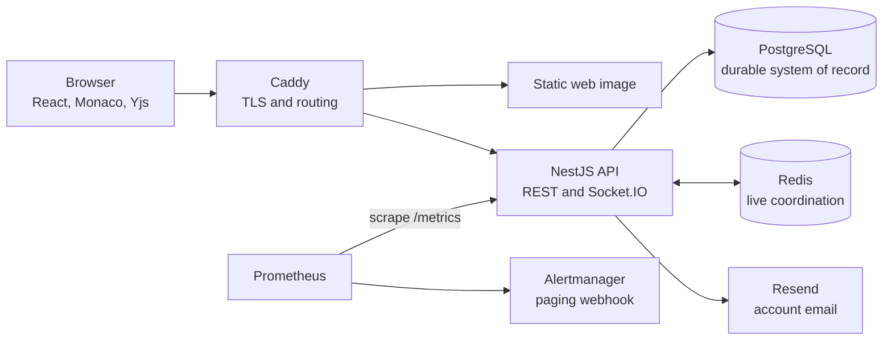

# Meridian

Meridian is a self-hosted, collaborative browser IDE. It combines a Monaco
editor, durable Yjs collaboration, workspace roles, version history, import and
export, and a production-oriented NestJS backend.

[](https://github.com/santinomarial/Meridian/actions/workflows/ci.yml)

## What it includes

- A React workspace with a file tree, tabs, Monaco editing, keyboard shortcuts,
  ZIP import/export, versions, and restore.
- Realtime Yjs editing with presence, workspace chat, reconnect recovery, and a
  durable browser outbox for unacknowledged updates.
- Verified-email accounts, revocable sessions, password recovery, workspace
  roles, and transactionally single-use invitations.
- A NestJS REST and Socket.IO API with PostgreSQL persistence, Redis
  coordination, structured logs, health checks, and Prometheus metrics.
- A supported single-server production stack with Caddy TLS, private data
  services, Alertmanager paging, and encrypted off-host backup hooks.
- An optional host-backed terminal for isolated non-production development.
  Production configuration rejects this feature because it is not a sandbox.

## Architecture



PostgreSQL is the durability boundary. Redis carries live coordination and
cross-replica fan-out, but it is not a document backup.

Collaborative text has two durable views: Yjs updates are committed as users
edit, while **Save** creates the plain-text checkpoint used by REST reads,
exports, version history, and terminal materialization. A successful
`yjs:ack` protects a live edit; a successful Save advances the product-visible
checkpoint. See [Document model and save](docs/explanation/document-model-and-save.md)
for the complete consistency model.

## Quick start

Requirements:

- Node.js 22.22 or later with npm
- Docker with Docker Compose v2
- OpenSSL

Clone the repository, then configure and start the API:

```bash
git clone https://github.com/santinomarial/Meridian.git
cd Meridian/server
npm ci
test ! -e .env && cp .env.example .env
openssl rand -hex 32
```

Put the generated value in `server/.env` as `JWT_SECRET`, replacing
`change-me-in-production`. Then run:

```bash
npm run infra:up
npm run db:migrate
npm run db:seed
npm run start:dev
```

In another terminal, start the client:

```bash
cd Meridian/client
npm ci
npm run dev
```

Open [http://localhost:5173](http://localhost:5173) and sign in with
`alice@meridian.dev` / `Meridian1!`.

The seed command rewrites its demo users and content; use it only with
disposable development data. The full
[getting-started tutorial](docs/tutorials/getting-started.md) includes service
health checks, expected output, the save-path verification, and cleanup.

There is no root package manifest. Run npm commands from `client/` or
`server/`.

## Development checks

Run these before proposing a change:

| Area | Working directory | Commands |
|---|---|---|
| Client | `client/` | `npm run lint`, `npm test`, `npm run build` |
| Server | `server/` | `npm run db:generate`, `npm run build`, `npm test` |
| Integration | `server/` | `npm run infra:up`, `npm run db:migrate`, `npm run test:integration` |
| Browser E2E | repository root | Follow the isolated [E2E procedure](docs/how-to/run-e2e-tests.md) |

The CI workflow also audits production dependencies, builds and scans the
production images, validates monitoring configuration, exercises multi-replica
behavior, and performs backup/restore smoke tests. See
[Run CI checks locally](docs/how-to/run-ci-locally.md) for the matching local
commands and safety notes.

## Production deployment

The supported production path is a single VPS running one API replica, the
bundled PostgreSQL and Redis services, the static SPA, and Caddy on ports 80 and
443. PostgreSQL, Redis, the API, and the web container remain private.

The repository includes:

- production and migration images;
- automatic Prisma migration execution during Compose startup;
- readiness checks for PostgreSQL and Redis;
- Caddy-managed HTTPS and same-origin REST/Socket.IO routing;
- Prometheus rules and Alertmanager webhook delivery; and
- atomic PostgreSQL dumps with checksums and a fail-closed encrypted restic
  offsite hook.

Start with [Deploy with Docker Compose](docs/how-to/deploy-with-docker-compose.md).
A live installation is not operationally ready until its DNS, TLS, secrets,
verified mail domain, paging receiver, encrypted off-host repository, restore
drill, host monitoring, and public smoke tests have all been completed.

Multiple API replicas are possible, but they require shared PostgreSQL, shared
private Redis, and affinity for the entire Socket.IO session. Read
[Deploy multiple API replicas](docs/how-to/deploy-multi-replica.md) and the
[scaling and failure model](docs/explanation/scaling-and-failure-model.md)
before changing the supported topology.

## Important boundaries

- The integrated terminal is intentionally unavailable in production and does
  not provide workload isolation in development.
- Browser authentication is designed for a same-site frontend and API. A
  cross-site deployment needs a deliberate cookie, CORS, CSRF, and TLS review.
- HTTP and socket rate limits are process-local; authoritative abuse controls
  belong at the ingress.
- Awareness and chat are ephemeral. Acknowledged Yjs updates and saved
  checkpoints are durable in PostgreSQL.
- There is no published release support schedule or availability guarantee.

Review the full [known limitations](docs/reference/known-limitations.md) and
[security boundaries](docs/explanation/trust-boundaries.md) before exposing a
deployment to users.

## Documentation

The [documentation map](docs/README.md) organizes the repository by task:

- [Get Meridian running locally](docs/tutorials/getting-started.md)
- [Understand the system](docs/explanation/system-overview.md)
- [Operate the production stack](docs/how-to/deploy-with-docker-compose.md)
- [Look up commands, configuration, APIs, and limits](docs/README.md#reference)
- [Client package](client/README.md)
- [Server package](server/README.md)

## Contributing and security

Read [Contributing](CONTRIBUTING.md) before proposing a change. Report suspected
vulnerabilities through the private process in [Security](SECURITY.md), not a
public issue or pull request.

## License

This repository currently has no license file and is unlicensed. No permission
to use, copy, modify, or distribute the code is granted unless the owner
provides separate terms.
