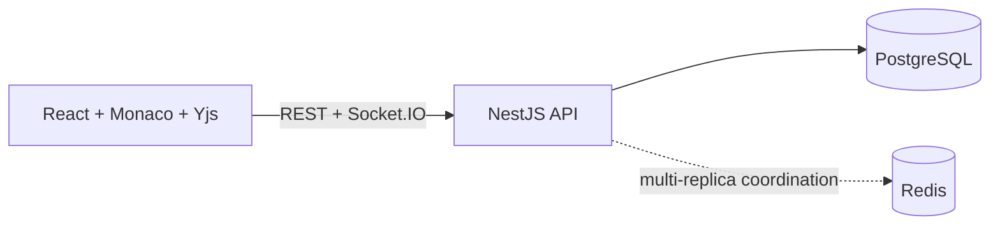

# Meridian

A collaborative browser IDE with Monaco, Yjs, React, NestJS, PostgreSQL, and Socket.IO.

## Capabilities

- Edit and organize project files in Monaco with tabs, shortcuts, import/export,
  version history, and restore.
- Collaborate through durable Yjs document updates, presence, workspace chat,
  and role-based access.
- Authenticate with verified email identities and revocable sessions; manage
  workspaces, members, and transactionally single-use invitations.
- Run a NestJS API backed by PostgreSQL, with optional Redis coordination and an
  optional non-production terminal.

## Get started

Follow the verified [getting-started tutorial](docs/tutorials/getting-started.md)
to install both packages, start local infrastructure, load the seed workspace,
make an edit, and save it.

This repository has no root package manifest. Run npm commands from `client/`
or `server/`.

## Documentation

- [Documentation map](docs/README.md)
- [System overview](docs/explanation/system-overview.md)
- [Deploy with Docker Compose](docs/how-to/deploy-with-docker-compose.md)
- [Client package](client/README.md)
- [Server package](server/README.md)

## Project policies

See [Contributing](CONTRIBUTING.md) before proposing a change and
[Security](SECURITY.md) before reporting a vulnerability.

## License

This repository currently has no license file and is unlicensed. No permission
to use, copy, modify, or distribute the code is granted unless the owner
provides separate terms.
