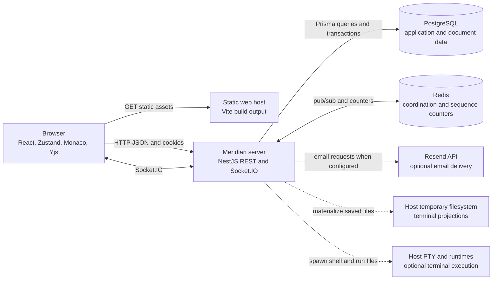
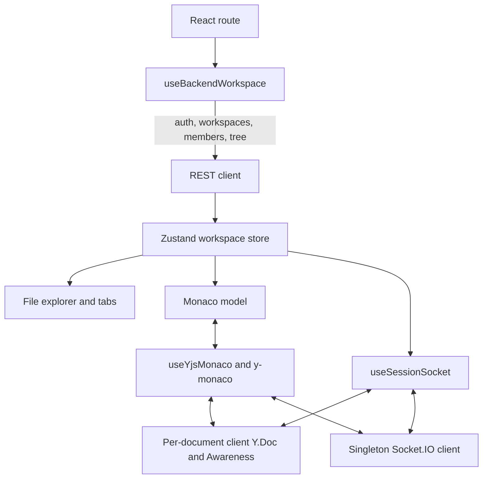
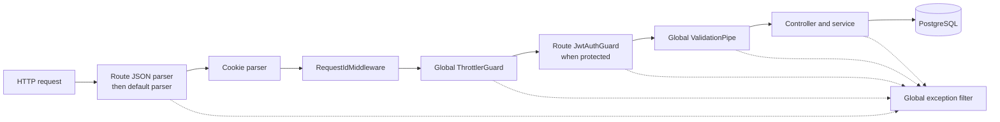
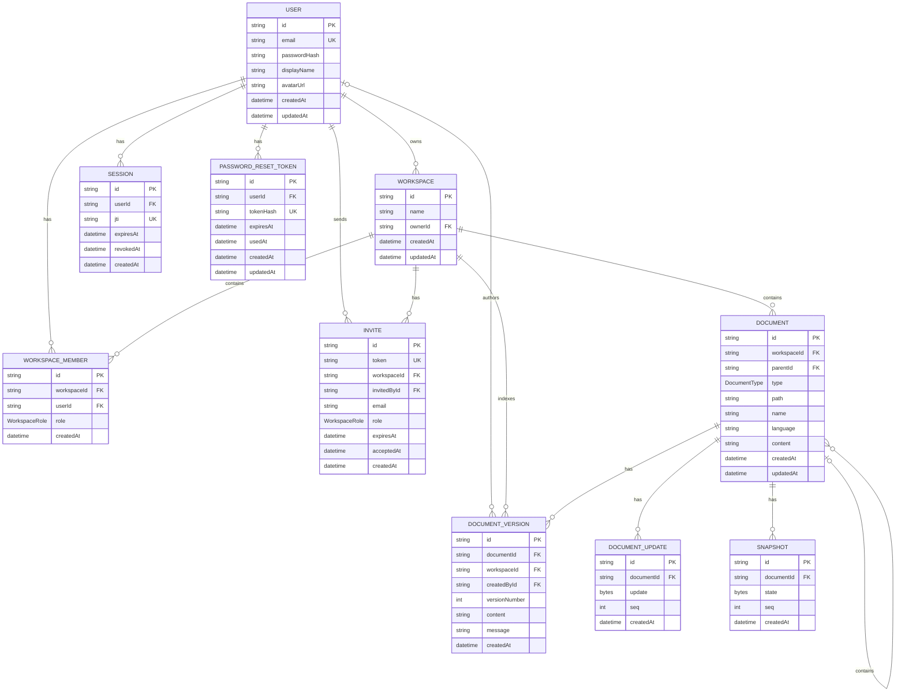
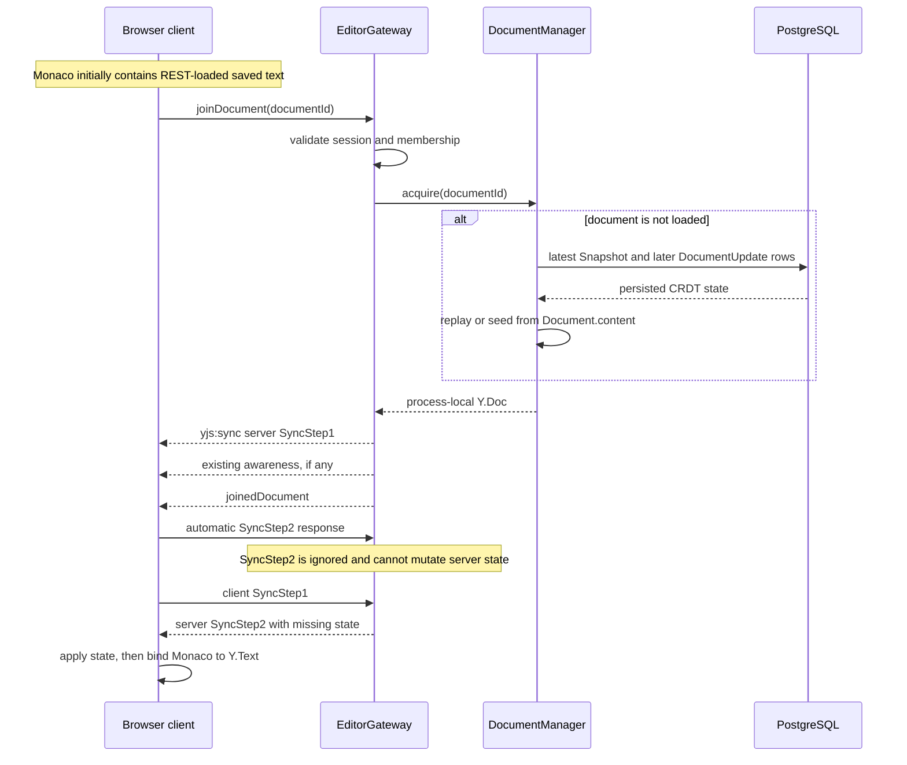
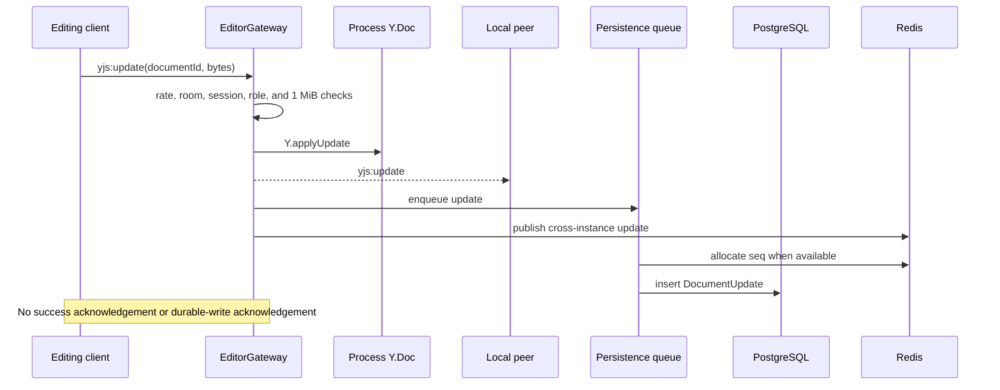

# Meridian architecture

This document describes the behavior implemented in this repository. It is not
a production deployment specification and does not describe unimplemented
controls as if they exist.

The primary implementation references are:

- [client application entry point](../client/src/App.tsx)
- [server bootstrap](../server/src/main.ts)
- [server application setup](../server/src/app.setup.ts)
- [Prisma schema](../server/prisma/schema.prisma)
- [realtime gateway](../server/src/modules/realtime/editor.gateway.ts)
- [document persistence](../server/src/modules/realtime/document-persistence.service.ts)
- [terminal gateway](../server/src/modules/terminal/terminal.gateway.ts)
- [CI workflow](../.github/workflows/ci.yml)

For setup and API-oriented usage, see the [repository README](../README.md),
[client README](../client/README.md), and [server README](../server/README.md).

## 1. System context

Meridian consists of two independently built applications:

1. A React single-page application built as static files by Vite.
2. A NestJS process that serves REST, Swagger, and Socket.IO on one HTTP
   listener.

The NestJS process does not serve the client build. A local or production
environment must host the static client separately and route browser API and
Socket.IO traffic to the server.



PostgreSQL is required. Redis is optional only for a deliberately
single-process deployment. Mail and terminal execution are optional features.
TLS termination, static hosting, DNS, load balancing, database backups, and
secret distribution are outside this repository.

## 2. Deployment and trust boundaries

| Boundary | Trust and responsibility |
|---|---|
| Browser | Untrusted input source. Client-side role checks and size checks improve UX but are not authorization controls. The server must validate every protected operation. |
| Static host | Delivers the Vite assets and must provide SPA fallback for browser routes. It is not implemented by the NestJS server. |
| NestJS process | Authentication, authorization, validation, document coordination, and optional host command execution occur here. A process owns its sockets, loaded Yjs documents, rate-limit state, and PTYs. |
| PostgreSQL | Durable store for users, sessions, workspaces, documents, versions, Yjs updates, and Yjs snapshots. It is required for readiness. |
| Redis | Best-effort cross-process message fan-out plus shared document sequence counters. It is not document storage and pub/sub has no replay. Multiple replicas are not safe without it, and current multi-replica persistence and restore limitations remain even with it. |
| Mail provider | Receives email addresses and action links when Resend is configured. Development without a provider logs action URLs; other environments report delivery failures internally. |
| PTY and temporary filesystem | High-risk boundary. A terminal shell runs as the server OS user. The temporary working directory and reduced environment are not an OS sandbox. |

In non-development environments, HTTP and Socket.IO CORS allow exactly
`CLIENT_ORIGIN` with credentials. Development allows only the
hard-coded localhost and 127.0.0.1 origins on ports 5173 through 5175.
The application does not install Helmet or configure a Content Security Policy
or other deployment security headers. TLS and required response headers must
be supplied by the static host, reverse proxy, or deployment platform.

## 3. Client architecture

### 3.1 Routing and build output

`BrowserRouter` defines these browser routes:

| Route | Page |
|---|---|
| `/` | Landing, registration, and login |
| `/forgot-password` | Landing page in password-reset-request mode |
| `/workspace` | Default workspace |
| `/workspace/:workspaceId` | Specific workspace |
| `/session/:id` | Workspace page compatibility route |
| `/invite/:inviteId` | Invite details and acceptance |
| `/reset-password/:token` | Password reset |

Workspace, invite, and reset pages are lazy-loaded. An unknown client-side
route redirects to `/`, but direct requests first reach the static
host; that host must rewrite unknown paths to `index.html`.

The browser resolves REST and Socket.IO endpoints independently:

- `VITE_API_URL` configures REST.
- `VITE_SOCKET_URL` configures Socket.IO.
- Development falls back to `http://localhost:3000`.
- A production build without either variable uses the page origin.

REST requests send `credentials: include`. The Socket.IO client also
sends credentials and allows both WebSocket and long-polling transports.

### 3.2 State and data flow



Workspace startup checks `/auth/me`, lists workspaces, selects the
requested or default workspace, reads member roles, then loads the document
tree and saved content. A fresh authenticated account with no workspace causes
the client to create `My Workspace`. A missing deep-linked workspace
returns to `/workspace` instead of silently opening another one.

An HTTP 401 during the authentication check redirects to the landing page.
Other backend-loading failures set the backend state to unavailable and expose
the in-memory demo workspace. Demo edits, chat, and file operations are local
to the browser and are not server-durable. When the backend is pending or
available, role checks fail closed; viewers are read-only.

The client first loads saved text over REST. When collaboration is available,
it waits for the server's Yjs sync response before constructing
`MonacoBinding`. This prevents an empty client `Y.Doc`
from replacing the REST-loaded Monaco model. Local Yjs updates are merged for
50 ms before send; awareness updates are coalesced for 80 ms.

Client `Y.Doc` and `Awareness` instances are held in
module-level maps. Leaving a document removes listeners and room membership,
but it does not destroy or remove those objects. A browser session that opens
many documents retains their CRDT state until the page reloads.

## 4. Server architecture

### 4.1 Module boundaries

| Area | Main responsibility |
|---|---|
| Auth and users | Registration, login, database-backed sessions, password reset, profile changes, and account deletion |
| Workspaces and invites | Workspace ownership, membership roles, owner-only administration, and bearer invite links |
| Documents | File tree CRUD, bulk import, ZIP export, plain-text saves, version history, and restore |
| Realtime | Socket authentication, document and workspace rooms, Yjs sync/update relay, awareness, chat, in-memory documents, and asynchronous persistence |
| Realtime authorization | Short-lived session cache, local invalidation, and Redis invalidation fan-out |
| Terminal | Optional PTY lifecycle, run-file dispatch, temporary workspace projection, and cross-instance projection sync |
| Prisma | PostgreSQL connection lifecycle and typed database access |
| Redis | Two ioredis connections, pattern subscriptions, publication, and atomic sequence allocation |

Swagger is exposed at `/docs` in every environment. The repository
does not disable or authenticate it in production. Test-only controllers are
excluded from the generated Swagger document.

### 4.2 HTTP request pipeline

The route-specific Express JSON parsers are registered before Nest guards and
controller validation:



This order matters: body bytes can be accepted and parsed before authentication
or Nest throttling. Reverse proxies should impose request-size and request-rate
limits before forwarding traffic.

The global validation pipe transforms DTOs, rejects unknown properties, and
uses `class-validator`. The exception filter returns:

```json
{
  "statusCode": 400,
  "error": "Bad Request",
  "message": "Example message",
  "requestId": "request correlation value",
  "timestamp": "ISO-8601 timestamp",
  "path": "/request/path"
}
```

Uncaught 5xx details are masked from clients and logged. Request IDs come from
the inbound `X-Request-Id` header or a generated UUID and are echoed
in the response. The inbound value is accepted as supplied, so it is a
correlation aid, not an authenticated identifier. A parser failure can occur
before the Nest request-ID middleware and can therefore have an empty ID.

### 4.3 HTTP throttling

Two named in-memory throttlers are configured:

| Throttler | Default | Scope |
|---|---:|---|
| `default` | 120 requests per 60 seconds | All HTTP endpoints |
| `auth` | 10 requests per 60 seconds | Auth controller in addition to the default limit |

Non-auth controllers skip the `auth` throttler. Health and readiness
still use the default throttler. `E2E_TEST=true` raises both limits
to 100,000.

The storage is process-local and the app does not configure Express
`trust proxy`. These limits are not a global abuse-control boundary
and may identify a reverse proxy rather than the originating client. A
production ingress needs its own controls and an explicit trusted-proxy review.

## 5. Authentication and session lifecycle

Passwords are hashed with Argon2id. Register and login create a
`Session` row and sign a JWT containing `sub`,
`email`, and `jti`. The JWT expiry and session expiry are
aligned. The default lifetime is seven days.

Register and login return the JWT in the JSON response and set it in the
`auth_token` cookie. The bundled client relies on the cookie and
does not persist the returned bearer token. Cookie properties are:

- `HttpOnly`
- `SameSite=Lax`
- `Secure` only when `NODE_ENV=production`
- `Path=/`

The HTTP guard prefers the cookie and otherwise accepts an
`Authorization: Bearer` token. It verifies the JWT and reads the
session row on every guarded HTTP request, rejecting missing, expired, or
revoked sessions. A rejected cookie token is cleared.

Socket.IO authentication accepts `handshake.auth.token` first and
then `auth_token` from the Cookie header. The handshake verifies the
JWT, session, session user, expiry, and revocation before connection.

Logout revokes the current session and publishes a realtime invalidation.
Password reset uses a random raw token while storing only its SHA-256 hash.
The reset transaction conditionally claims the token, changes the Argon2id
password, invalidates sibling reset tokens, and revokes every user session.
The forgot-password response is intentionally the same whether the account
exists or not.

There is no email verification flow. There is also no scheduled deletion of
expired or revoked sessions, expired or used reset tokens, or expired invites.
Those rows remain until related users or workspaces are deleted or an operator
adds a maintenance process.

### Mail behavior

When `RESEND_API_KEY` is present, password reset and invite messages
are sent through the Resend HTTP API. Development without a key prints the
action URL. In other environments without a key, sending throws internally.
Password-reset requests still return the generic response, and invite creation
still returns the shareable link; the delivery failure is logged.

The actual reset-token lifetime uses `FORGOT_PASSWORD_TTL_MINUTES`, but the
email copy currently says 30 minutes through a separate hard-coded constant.
Changing the environment value does not update that message.

The cookie policy is suitable for a same-site frontend/API deployment. A
cross-site deployment requires a deliberate cookie and CSRF design change.
There is no separate CSRF token mechanism in this code.

## 6. Authorization and resource semantics

Workspace access uses `OWNER`, `EDITOR`, and
`VIEWER`. `Workspace.ownerId` and its owner membership
are the canonical ownership records. Generic member APIs cannot assign
`OWNER` or change/remove the canonical owner.

| Operation | OWNER | EDITOR | VIEWER |
|---|:---:|:---:|:---:|
| Read workspace, tree, documents, versions, and ZIP export | Yes | Yes | Yes |
| Join document/workspace realtime rooms and chat | Yes | Yes | Yes |
| Send awareness | Yes | Yes | Yes |
| Create, update, delete, import, save, or restore documents | Yes | Yes | No |
| Send Yjs document mutations | Yes | Yes | No |
| Start or use terminal when enabled | Yes | Yes | No |
| Rename/delete workspace or manage membership/invites | Yes | No | No |

REST helpers generally return 404 to a non-member so private workspace and
document IDs are not enumerable; a member with insufficient role receives 403.
Socket handlers return error events and revoke room access when reauthorization
fails.

Invite creation and token listing are owner-only. An invite token is a random
24-byte base64url bearer credential stored in plaintext with a seven-day
expiry. `Invite.email` is delivery metadata, not an acceptance
restriction. Any authenticated holder can accept the token, and the token is
reusable until expiry. The first acceptance stamps `acceptedAt`;
later acceptances can add other users, while an existing member receives an
idempotent success response.

The authenticated `GET /users/:userId` endpoint is not
workspace-scoped and returns the target user's email and profile fields to any
authenticated caller who knows the ID.

Account deletion removes the user's owned workspaces and then the user in one
database transaction because the owner foreign key is restrictive. Workspace
and document descendants are otherwise removed through cascade relations.
Realtime invalidations are published after relevant session, member,
workspace, or account mutations.

## 7. Data model



Nullable columns are shown without Mermaid-specific optional syntax:
`User.passwordHash`, `User.avatarUrl`,
`Invite.email`, `Invite.acceptedAt`,
`Document.parentId`, `Document.language`,
`Document.content`, `DocumentVersion.createdById`,
`DocumentVersion.message`, `Session.revokedAt`, and
`PasswordResetToken.usedAt`.

Important constraints and delete behavior:

- Membership is unique by `(workspaceId, userId)`.
- Document path is unique by `(workspaceId, path)`.
- Version number is unique by `(documentId, versionNumber)`.
- Update sequence is unique by `(documentId, seq)`.
- Session `jti`, invite token, reset-token hash, and user email are
  individually unique.
- Documents are a recursive tree. Root documents have no parent; deleting a
  parent cascades to descendants.
- Deleting a workspace cascades to its members, invites, documents, and
  workspace-indexed versions.
- Deleting a document cascades to versions, CRDT updates, and snapshots.
- Deleting a version author sets `createdById` to null.
- Deleting a user cascades memberships, sessions, reset tokens, and sent
  invites, but owned workspaces must be deleted first by the account service.

## 8. Document model and REST behavior

### 8.1 Two document representations

Meridian does not have one continuously synchronized document authority. It
maintains parallel representations:

| Representation | Used by |
|---|---|
| `Document.content` | REST tree/content reads, manual saves, version creation, ZIP export, and terminal materialization |
| In-memory `Y.Doc` plus `Snapshot`/`DocumentUpdate` | Live collaborative text and collaborative cold-load recovery |
| `DocumentVersion.content` | User-visible save history, detail, diff input, and restore source |

The normal browser flow often aligns the first two: edits enter the Yjs
document, then an explicit save PATCH writes the visible Monaco text to
`Document.content` and creates a version when content changed.
However, server-side Yjs persistence does not update
`Document.content`. Unsaved collaborative edits therefore do not
appear in REST export or a newly materialized terminal.

The reverse direction is also not general. Arbitrary REST content PATCHes and
bulk import updates do not reset or update existing Yjs history. Bulk import
can overwrite an existing file's `Document.content` without making a
version and without reconciling a loaded or persisted CRDT. If any CRDT history
already exists, a later collaborative cold load uses that history rather than
the newer plain-text column.

Version restore is the only specialized reconciliation path, and it is a
multi-step, local-instance operation described in section 10.

### 8.2 File tree invariants and limits

The server validates names, normalized relative paths, parent workspace, parent
folder type, cycles, descendant moves, and path collisions. Moving or renaming
a folder updates descendant paths in a transaction.

| Limit | Value and enforcement |
|---|---|
| Saved content per file | 1 MiB of UTF-8 bytes on create, update, and bulk import |
| Bulk import | At most 1,000 files, 2,000 total documents, and 25 MiB of decoded text |
| Bulk transaction | 60-second Prisma transaction timeout |
| Document path | 4,096 UTF-8 bytes, 255 bytes per segment, 64 segments |
| Client ZIP input | 100 MiB compressed; 25 MiB decoded text; same file/document/path limits before JSON upload |
| Bulk JSON request | 26 MiB Express wire limit |
| Single document JSON request | 7 MiB Express wire limit |
| Other JSON and URL-encoded requests | 100 KiB Express wire limit |

The client accepts supported text files and skips common dependency, VCS,
build, cache, and virtual-environment directories during import. These client
filters are not security controls; server semantic limits are independent.

Workspace export builds a ZIP in server memory from
`Document.content`. It skips unsafe paths and the reserved
`.meridian-build` and `.terminal-sandboxes` prefixes.
There is no aggregate workspace-size quota, server-side export size cap, or
streaming ZIP construction. Repeated creates and updates can grow a workspace
beyond the bulk import ceiling, so export memory use can exceed 25 MiB.

A meaningful content PATCH creates the next plain-text version in the same
transaction as the content change. Version numbers are selected as
`max + 1`; the unique constraint detects concurrent duplication,
but the service has no conflict retry.

## 9. Realtime protocol

### 9.1 Rooms, authentication, and authorization

The default Socket.IO namespace and path are used. Rooms are named
`document:<documentId>` and
`workspace:<workspaceId>`.

After handshake authentication, document join, workspace join, chat, Yjs, and
awareness events check the socket's session and relevant membership. Active
checks may use a one-second authorization cache. `leaveDocument` instead
requires that the socket is already in the room and performs cleanup without a
new database authorization check. Local and Redis invalidations evict cached
access and can disconnect sockets or remove room access. A ten-second sweep
rechecks passive connections so a socket that sends nothing does not retain
room delivery indefinitely.

The editor gateway applies a per-socket fixed one-second rate limit, default 50
events per second, to document join, workspace join, chat, Yjs sync/update, and
awareness handlers. It does not cover terminal gateway events.

### 9.2 Initial document synchronization



The server's `yjs:sync` handler is intentionally read-only. It
accepts only client SyncStep1, silently ignores the protocol's automatic
SyncStep2 response, and rejects other mutating sync messages. Document
mutation must use `yjs:update`, where write roles, relay, and
persistence are enforced.

The first collaborative open loads the newest snapshot, then update rows with
sequence greater than that snapshot. When neither exists, the manager seeds
`Y.Text("content")` from `Document.content`. A
deterministic Yjs client ID makes concurrent first seeds identical, and a
sequence-zero insert uses `createMany(skipDuplicates)`. Empty
content creates no seed row.

Concurrent acquires in one process share the same loading promise and
`Y.Doc`. A loaded document is reference-counted and destroyed 30
seconds after its last socket leaves by default.

### 9.3 Live update path



The sender is excluded from the local relay because it already applied the
update. Persistence is asynchronous and process-local: the gateway does not
wait for PostgreSQL, and failures are logged and swallowed. A client emit,
continued connection, or peer relay therefore does not mean the update is
durable. Graceful shutdown waits for currently known write-chain tails, but a
crash or failed write can lose changes after all live copies disappear.

Yjs sync messages, Yjs updates, and awareness updates each have a configurable
one MiB default cap. Chat is limited to 2,000 characters. Chat sender ID and
name are built from the authenticated server-side user, but the sender adds its
own optimistic local message because the server relays only to peers.

Awareness is ephemeral and not written to PostgreSQL. The server verifies room
membership and payload size, tracks awareness client IDs for disconnect
cleanup, and relays the opaque Yjs awareness data. It does not bind the
awareness payload's displayed `user` metadata to the authenticated
identity, so presence display identity is client-asserted by an authenticated
workspace member.

## 10. Persistence, compaction, and restore

### 10.1 Storage roles

| State | Location | Lifetime |
|---|---|---|
| Saved plain text | PostgreSQL `Document.content` | Durable |
| User-visible versions | PostgreSQL `DocumentVersion` | Durable |
| CRDT update log | PostgreSQL `DocumentUpdate` | Durable after asynchronous insert succeeds |
| CRDT compacted state | PostgreSQL `Snapshot` | Durable after compaction succeeds |
| Active CRDT and awareness | Server process memory | Until grace-period teardown or process exit |
| Client CRDT and awareness | Browser module maps | Until page reload |
| Chat and presence events | Socket.IO and Redis pub/sub | Ephemeral |
| Document sequence counter | Redis, with process-local fallback | Coordination state, not document content |
| Terminal projection | Host temporary directory | Disposable, process/host local |

### 10.2 Sequence allocation and compaction

When Redis is available, a Lua seed-and-increment operation allocates a unique
sequence number from `meridian:doc:<documentId>:seq`. The seed
uses the maximum sequence found in update and snapshot tables. Without Redis,
each process uses an in-memory counter seeded from the database high-water
mark; this fallback is safe only when exactly one server process can write the
document.

Each process serializes its own writes per document through a promise chain.
Every `SNAPSHOT_EVERY_N_UPDATES` successful local writes, default
100, that process attempts a serializable transaction:

1. Read the latest durable snapshot.
2. Read update rows after the base and through the last sequence persisted by
   this process.
3. Apply those rows to a temporary Yjs document.
4. Insert a new snapshot tagged with the local cutoff sequence.
5. Delete covered update rows and older snapshots.

The threshold is per process, not a global count. More importantly, Redis
allocation happens before each PostgreSQL insert while write chains are
process-local. Across replicas, sequence 6 can commit and compact while an
earlier allocated sequence 5 is still pending on another process. A snapshot
tagged 6 can therefore omit 5; a later insert of 5 is then below the snapshot
cutoff and cold load ignores it. Serializable isolation of the compaction
transaction does not close that later-insert gap. Current compaction is not a
safe cross-replica durability mechanism.

Persistence bookkeeping maps and settled promise-chain entries are not evicted
when a server-side `Y.Doc` is torn down. A long-lived process that
touches many distinct documents accumulates per-document counters and chain
entries until restart.

### 10.3 Version restore

Restore is not one atomic transaction across all representations:

1. `DocumentsService` commits a transaction that writes
   `Document.content` and creates a new
   `DocumentVersion`.
2. `DocumentRestoreService` runs after that commit.
3. If this process has the document loaded, it replaces its Yjs text, emits a
   local `yjs:update`, flushes this process's persistence chain,
   replaces CRDT history with a sequence-zero snapshot, best-effort clears the
   Redis sequence key, and emits `document:restored`.
4. If this process does not have the document loaded, it deletes CRDT history
   so the next local cold load seeds from `Document.content`.
5. The controller then best-effort syncs restored text into active terminal
   projections.

A failure after step 1 can leave the content/version committed while CRDT state
or terminal projections remain unreconciled. Restore broadcasts and CRDT reset
are local to the handling process; they are not published through Redis.
Another replica can retain and later persist its pre-restore `Y.Doc`
or pending writes. Multi-replica restore is therefore not convergent.

## 11. Redis and multiple server instances

Redis uses separate publisher and subscriber clients with lazy connection,
offline queues disabled, no command retries, and no automatic reconnection.
Each client gets a three-second startup connection timeout.

| Redis name | Purpose |
|---|---|
| `document:*:updates` | Cross-instance Yjs update relay |
| `document:*:awareness` | Cross-instance awareness relay |
| `workspace:*:chat` | Cross-instance workspace chat |
| `realtime:authorization:invalidate` | Session, user, and membership invalidation |
| `meridian:sandbox:*:sync` | Best-effort terminal projection changes |
| `meridian:doc:<id>:seq` | Atomic document update sequence counter |

Redis is a trusted internal boundary. Inbound collaboration, chat, and sandbox
pub/sub messages are not independently authenticated or re-authorized against
PostgreSQL. A party that can publish to these channels can inject events. The
channel and key names are not prefixed by deployment or environment, and Redis
pub/sub is not isolated by logical database number. Deployments must not share
an untrusted or overlapping Redis channel namespace.

Messages carry a process origin ID so the publisher ignores its own fan-out.
Inbound document updates are applied only when that instance already has the
document loaded. Pub/sub has no replay; an unloaded instance relies on the
asynchronously written PostgreSQL history when it later loads the document.
Loading concurrently with the original asynchronous write can temporarily
miss that update.

If Redis is unavailable at startup, the server logs a warning and continues.
Readiness reports Redis as `disabled`, but remains ready when
PostgreSQL works. The application does not enforce that only one replica is
running.

If Redis is lost after startup, there is no reconnect loop. The service can
remain marked available while commands fail; readiness reports Redis
`error`, publications are lost, and sequence allocation falls back
to process-local counters on command failure. HTTP readiness still depends
only on PostgreSQL. Multiple active replicas during either Redis failure mode
can diverge, miss authorization invalidations, and allocate colliding
sequences.

Socket.IO connections and rooms are process-local, so any load balancer must
support WebSocket upgrade and sticky routing for long-polling/session
continuity. Shared PostgreSQL, Redis, and sticky routing are necessary for
multiple replicas, but they are not sufficient to fix the sequence-compaction
and restore defects above. Multi-replica collaborative editing should be
treated as unsupported until those paths are redesigned and tested.

See [scaling.md](scaling.md) for additional deployment discussion, but source
code and the limitations in this document take precedence over broader design
intent.

## 12. Terminal execution

The terminal is disabled by default and enabled with
`ENABLE_TERMINAL=true`. It uses the authenticated Socket.IO
connection. Owners and editors can start or use a terminal; viewers and
non-members are rejected. Session and membership checks use the same
one-second active-event cache and ten-second passive sweep used by the realtime
authorization layer. Revocation kills the PTY.

One terminal session is allowed per socket. Starting a session:

1. Recreates a temporary directory under
   `os.tmpdir()/meridian-terminal-sandboxes/<workspace>/<user>`.
2. Materializes current `Document.content` paths from PostgreSQL.
3. Spawns the server user's configured shell through `node-pty` with
   that directory as `cwd`.
4. Passes a reduced environment containing HOME, PATH, terminal/locale values,
   shell, and optional USER/LOGNAME, rather than application secrets.

The directory path is keyed by workspace and user, not socket. Two concurrent
sockets for the same user and workspace can therefore share and recreate the
same projection even though each socket has its own PTY session.

REST file creates, updates, renames, deletes, and restores are projected into
active terminal directories locally and over Redis on a best-effort basis.
Terminal-created or terminal-modified files are not written back to
PostgreSQL. The direction is saved database content to disposable projection,
not bidirectional filesystem synchronization.

Run-file dispatch supports:

| Extension | Host command |
|---|---|
| `.py` | `python3` |
| `.js` | `node` |
| `.ts` | `npx --no-install tsx` |
| `.sh` | `bash` |

These executables must exist on the server host. Paths used by the projection
and run-file helper reject absolute paths, traversal, control characters, and
symlink escape, and file writes use no-follow flags where available.

These checks do not confine the interactive shell. The PTY runs as the server
OS user and can execute arbitrary commands, change directory, consume host
resources, and access anything allowed to that account. HOME and `cwd`
are convenience boundaries, not isolation. Production use requires a real
container, VM, or comparable execution sandbox with CPU, memory, process,
filesystem, network, and syscall controls.

Sessions have a 30-minute idle limit and a four-hour absolute limit. They are
killed on socket disconnect and module shutdown, with a force-kill attempt
after three seconds. Terminal events use DTO validation and authorization but
do not use `WsRateLimiter`; `terminal:input` also has no
application-level string-length cap.

A natural PTY exit removes the `TerminalService` session but does not call
`TerminalSandboxService.unregister`. Its active projection entry, socket
reference, and file-sync activity can remain until that socket ID starts a
replacement session or the process exits. Terminal teardown does not delete
the temporary directory; it remains until a later materialization recreates it
or an external cleanup removes it.

## 13. Operations and configuration

### 13.1 Health, logging, and shutdown

| Endpoint | Behavior |
|---|---|
| `GET /health` | Process liveness data. It does not probe dependencies. |
| `GET /ready` | Two-second PostgreSQL and Redis probes. Returns 503 only when PostgreSQL fails. Redis can be `ok`, `error`, or `disabled` without changing HTTP readiness. A 200 response includes dependency details; the global 5xx filter converts the intentional 503 to the generic internal-error envelope, so the failed dependency object is not returned to the caller. |

Pino logs are pretty-printed in development and JSON elsewhere. The
configurable log level defaults to `info`. Authorization and Cookie headers,
password/token body fields, and Set-Cookie response headers are configured for
redaction. Request URLs are not redacted, so raw bearer invite tokens in
`/invites/:token` paths can enter access and error logs. HTTP errors include
the request correlation ID; Socket.IO errors are emitted as protocol events.

Nest shutdown hooks are enabled. Shutdown waits for known document write
chains, disconnects Prisma and Redis, releases realtime timers/subscriptions,
and kills active terminal sessions. The host must deliver a supported
termination signal and allow enough grace time. This does not make already
failed or never-enqueued writes durable.

### 13.2 Environment configuration

Startup uses a Zod schema and fails on invalid required values.

| Variable | Default or requirement |
|---|---|
| `NODE_ENV` | `development`; allowed values are development, production, test |
| `PORT` | 3000 |
| `CLIENT_ORIGIN` | `http://localhost:5173` |
| `DATABASE_URL` | Required |
| `REDIS_URL` | `redis://localhost:6379` |
| `JWT_SECRET` | Required, at least 16 characters |
| `JWT_EXPIRES_IN` | `7d` |
| `LOG_LEVEL` | `info` |
| `DOC_TEARDOWN_GRACE_MS` | 30000 |
| `SNAPSHOT_EVERY_N_UPDATES` | 100 |
| `HTTP_TTL_SECONDS` / `HTTP_LIMIT` | 60 / 120 |
| `AUTH_TTL_SECONDS` / `AUTH_LIMIT` | 60 / 10 |
| `WS_MESSAGE_LIMIT_PER_SECOND` | 50 for editor-gateway handlers |
| `WS_MAX_YJS_UPDATE_BYTES` | 1048576 |
| `ENABLE_TERMINAL` | false |
| `RESEND_API_KEY` | Optional |
| `MAIL_FROM` | `Meridian <no-reply@meridian.local>` |
| `FORGOT_PASSWORD_TTL_MINUTES` | 30 |
| `E2E_TEST` | `false` |

`E2E_TEST=true` cannot be combined with
`NODE_ENV=production`; startup validation rejects it. In a
non-production E2E process it raises rate limits and exposes Swagger-excluded
test helpers:

- `POST /e2e/cleanup` deletes only users on
  `@example.com` whose email starts with an exact allow-listed test
  prefix: `e2e-`, `int-auth-`,
  `int-doc-`, `int-throttle-`, or
  `int-workspace-owner-`.
- `POST /auth/e2e/password-reset-token` creates a token only for a
  matching allow-listed test email.

Outside that mode the guards return 404 before DTO pipes run. These helpers do
not use a shared secret and must never be enabled on a reachable shared
environment despite their additional allow-list.

### 13.3 Build, migration, and local commands

The client and server have separate lockfiles and commands. There is no root
package script that installs or runs both.

```bash
# Infrastructure and server
cd server
npm ci
npm run infra:up
npm run db:migrate
npm run db:seed
npm run start:dev

# Client, in a second shell
cd client
npm ci
npm run dev
```

Build and production-start commands are:

```bash
cd server
npm ci
npx prisma generate
npx prisma migrate deploy
npm run build
npm run start:prod

cd ../client
npm ci
npm run build
```

`prisma migrate dev`, exposed as `npm run db:migrate`, is
for development. Deployment should use `npx prisma migrate deploy`
before starting the compiled server. The repository does not include a
production process manager, reverse-proxy configuration, container image, or
hosting manifest.

## 14. Verification and CI

The GitHub Actions workflow uses Node.js 22.

| Job | What it verifies |
|---|---|
| Server | `npm ci`, Prisma client generation, Nest build, Jest unit tests |
| Client | `npm ci`, project-reference TypeScript build, Vitest unit tests, Vite production build |
| Server integration | Prisma migrations plus Supertest against the real Nest application, PostgreSQL 16, and Redis 7 |
| End to end | Compiled server, PostgreSQL 16, Redis 7, terminal enabled, Vite dev server, and Playwright Chromium |
| Lint | Client ESLint only |

Relevant local commands:

```bash
cd server
npm test
npm run test:integration

cd ../client
npm test
npm run lint
npm run build
npm run test:e2e
```

The server integration suite requires its PostgreSQL/Redis environment and
applied migrations. Playwright starts the Vite dev server itself;
backend-dependent groups can skip when the API is unavailable. CI provisions
PostgreSQL, Redis, the compiled API, E2E helpers, and terminal support so those
groups execute in the full run.

CI does not currently exercise a multi-replica deployment, out-of-order
cross-replica persistence, Redis loss/recovery, cross-replica restore, terminal
resource isolation, production TLS/cookie routing, database backup/restore, or
long-running process memory growth.

## 15. Known architectural limitations

The most material limitations are collected here so they are not mistaken for
guarantees:

1. Multi-replica Yjs durability is unsafe because sequence allocation and
   process-local write/compaction ordering can create snapshot gaps.
2. Version restore reconciles only the handling process and is non-atomic
   across plain text, CRDT state, and terminal projection.
3. Live edit persistence is asynchronous, has no client durability
   acknowledgement, and logs and swallows failures without durable retry.
4. `Document.content` and CRDT history can diverge after unsaved
   edits, arbitrary REST updates, bulk overwrite, failed persistence, or failed
   restore reconciliation.
5. Redis pub/sub has no replay or reconnect path; multi-replica operation
   during Redis failure can diverge and allocate duplicate sequence numbers.
   Inbound pub/sub events trust Redis, and names are not environment-prefixed.
6. The terminal is host command execution, not a security sandbox, lacks
   editor-gateway message-rate protection, and leaks its active projection
   registration after a natural PTY exit.
7. HTTP request parsing precedes Nest authentication/throttling; HTTP
   throttling is process-local and proxy trust is not configured.
8. Client CRDT objects and server persistence bookkeeping grow per touched
   document until browser reload or server restart, respectively.
9. ZIP export is built in memory without a server-side output cap.
10. Version number allocation has a concurrent unique-conflict failure mode
    without retry.
11. Invite tokens are plaintext, reusable bearer links; optional invite email
    does not bind acceptance identity.
12. Awareness display identity is client-asserted, email is not verified, and
    an authenticated user lookup can disclose another user's email by ID.
13. Expired/revoked authentication and invite records have no scheduled
    retention cleanup.
14. Reset-token email copy remains fixed at 30 minutes even when its configured
    lifetime changes.
15. Bearer invite tokens can be retained in request logs because they are URL
    path parameters and URL redaction is not configured.
16. Production infrastructure, security headers, ingress controls, isolation,
    observability backend, backup policy, and disaster-recovery behavior are
    not defined in this repository.
