# Client architecture

The client is a Vite-built React SPA. React Router owns browser navigation,
Zustand holds workspace and UI state, Monaco owns editor models, and Yjs bridges
those models to Socket.IO collaboration.

<picture>
  <source media="(prefers-color-scheme: dark)" srcset="../diagrams/rendered/client-architecture-dark.svg">
  <source media="(prefers-color-scheme: light)" srcset="../diagrams/rendered/client-architecture-light.svg">
  
</picture>

## Routing and startup

The application has landing, forgot-password, email-verification, workspace,
compatibility session, invite, and reset-password routes. Workspace,
verification, invite, and reset pages are lazy-loaded. Unknown client routes
return to the landing page, while direct deep links depend on the static host
returning `index.html`.

Workspace startup checks the current session, lists the user's workspaces,
selects the requested or default workspace, loads membership roles, and then
loads the document tree and saved checkpoint content. A fresh authenticated
account gets a default workspace. An unavailable deep-linked workspace returns
to the default workspace route instead of silently opening a different one.

An authentication `401` returns to sign-in. Other loading failures render the
backend-unavailable gate with retry and logout actions; the legacy mock
workspace is not activated. While backend state is pending or available,
permissions fail closed: a viewer cannot mutate documents merely because the
UI has stale role state.

## Three kinds of client state

The store separates concerns that have different lifetimes:

- workspace data and editor mirrors loaded from REST;
- UI state such as tabs, panels, theme, diagnostics, and save indicators; and
- connection, role, generation, and resynchronization metadata.

Monaco remains the editing surface, but a collaborative file's authoritative
live value is its Yjs text. The client initially displays the REST checkpoint,
waits for the server's Yjs sync response, and only then creates the
`MonacoBinding`. This avoids binding an empty client document over the loaded
text.

Local Yjs changes are merged over a short window before send. Each merged update
is written to an IndexedDB outbox before emission and removed only after the
server's durable `yjs:ack`. Reconnect resends pending entries with the same
idempotency key. Save flushes the binding, waits briefly for this outbox to
drain, and then requests a server checkpoint. The full boundary is canonical in
[Document model and save](document-model-and-save.md).

## Document lifetime

Browser Yjs state is reference-counted by active editor bindings. Closing the
final binding removes listeners, destroys the awareness object and `Y.Doc`, and
deletes them from the module maps. Late events use lookup-only access and are
ignored rather than recreating an inactive document. Reopening allocates fresh
state and performs a new sync, so visiting many files does not retain every
CRDT for the page lifetime.

A `document:restored` event advances the known generation and forces the
binding effect to tear down and rejoin. This discards the dead lineage rather
than attempting to merge restored and pre-restore CRDT state. See
[Persistence, compaction, and restore](persistence-compaction-and-restore.md).

REST and Socket.IO endpoints are resolved independently at build time, and both
transports include credentials. Production defaults to the browser origin;
development defaults to the local API. The singleton socket allows workspace
chat, document bindings, and terminal UI to share one authenticated connection.
