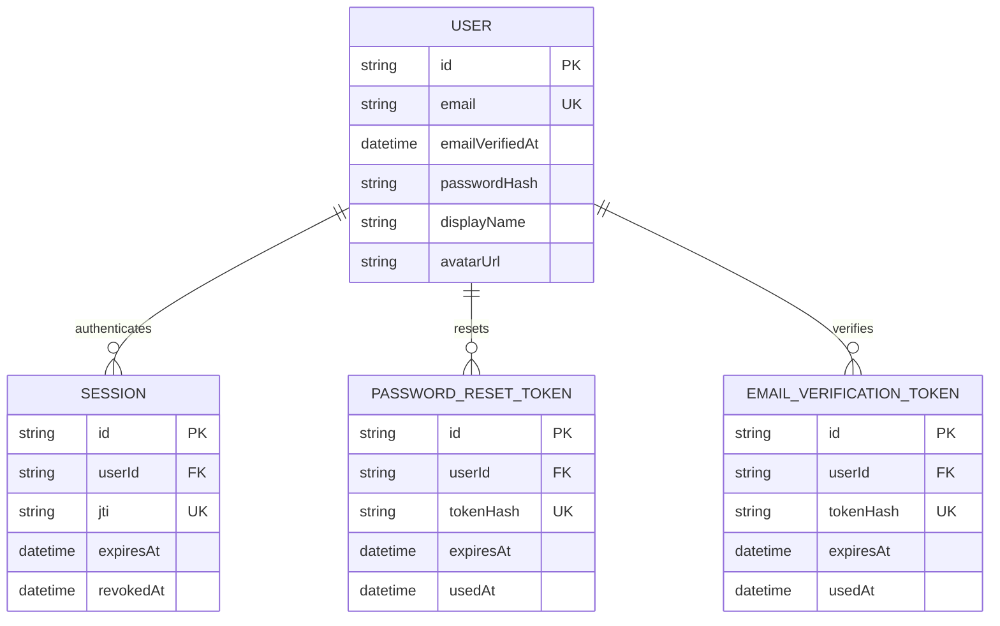
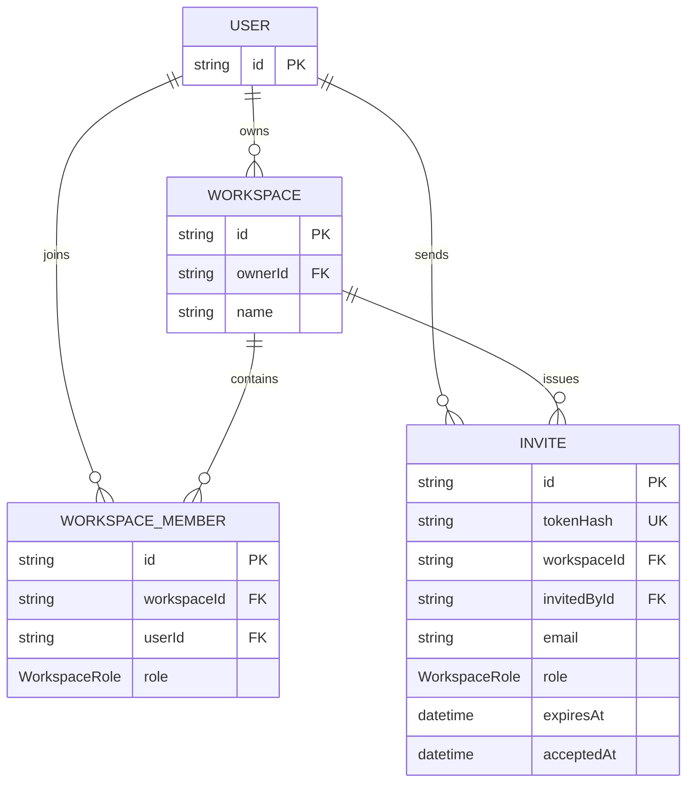
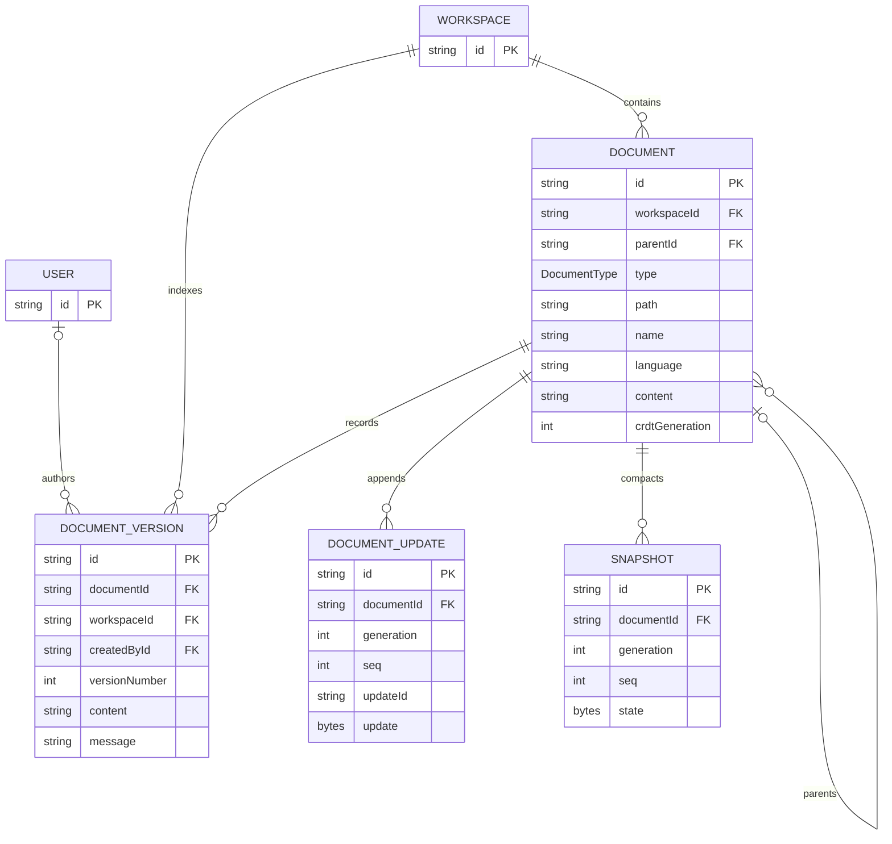

# Data model

PostgreSQL stores identity, authorization, workspace structure, saved
checkpoints, version history, and generation-aware Yjs history. Redis and
process memory hold coordination state, not additional application records.

## Identity lifecycle

## Workspace access

## Documents and collaborative history

Mermaid does not express all nullability in these diagrams. Email verification
time, password hashes, and avatars can be absent; invite email and acceptance
time are optional; document parent, language, and content can be null; version
author/message, session revocation, verification/reset usage, and legacy update
IDs can also be null.

## Invariants

Membership is unique per workspace and user, and document paths are unique per
workspace. Documents form a recursive tree; root nodes have no parent, and
deleting a parent cascades to descendants.

Versions are numbered uniquely per document. Update ordering and idempotency are
scoped to a CRDT lineage:

- `(documentId, generation, seq)` is unique; and
- `(documentId, generation, updateId)` is unique.

`Document.crdtGeneration` selects the current lineage. Updates and snapshots
carry the same generation so a restore or import reset can replace history
without allowing delayed writes from the prior lineage to reappear. Sequence
numbers can restart in a new generation.

Deleting a workspace cascades through memberships, invites, documents, and
workspace-indexed versions. Deleting a document cascades through descendants,
versions, updates, and snapshots. Deleting a version author preserves history
by setting `createdById` to null. User-owned workspaces use restrictive owner
semantics and are explicitly deleted as part of account deletion before the
user row is removed. Verification and reset tokens cascade with their user.

Why the three text-bearing model families exist is explained in
[Document model and save](document-model-and-save.md). Their generation,
ordering, and compaction behavior is explained in
[Persistence, compaction, and restore](persistence-compaction-and-restore.md).
