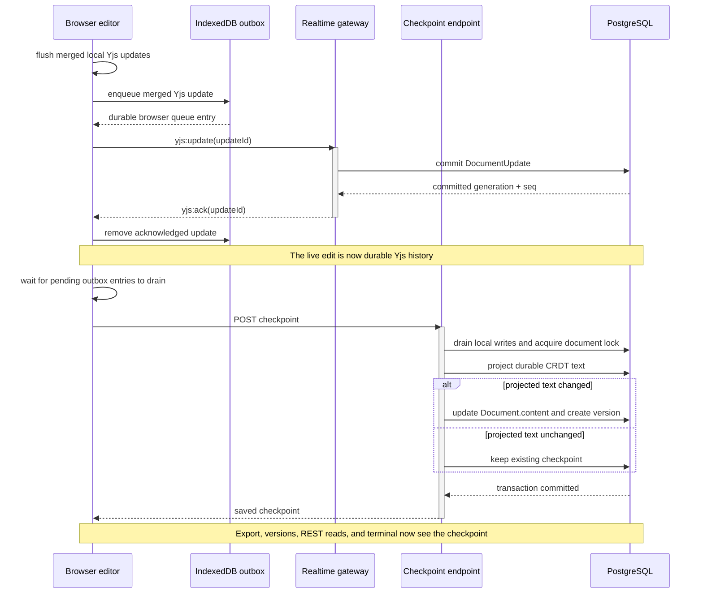

# Document model and save

Meridian separates collaborative durability from the user-visible saved
checkpoint. This avoids rewriting a large plain-text column and version row for
every keystroke while preserving an explicit meaning for Save.

| Representation | Purpose |
|---|---|
| In-memory `Y.Doc` | Active collaborative state for one process or browser |
| `DocumentUpdate` and `Snapshot` | Durable, generation-aware CRDT state used for cold load |
| `Document.content` | Plain-text checkpoint used by REST reads, export, and terminal materialization |
| `DocumentVersion.content` | Immutable user-visible save/restore history |

`Document.content` changes only through document creation, bulk import,
checkpoint, or version restore. Live Yjs updates never write it. Metadata
`PATCH` rejects `content`, preventing an independent plain-text write from
silently diverging from the CRDT.

## Save as a consistency boundary

The client flushes its current binding and waits briefly for pending durable
acknowledgements before requesting the checkpoint. The server also drains its
local persistence chain, acquires the document advisory lock, projects the
current generation from durable snapshots and updates, and compares it with the
existing checkpoint. If text changed, the checkpoint and next version are
written in the transaction; otherwise Save is a successful no-op.

This means a collaborative edit can already be durable in Yjs history while
remaining absent from export, version history, ordinary REST reads, and a newly
materialized terminal until Save succeeds. Those consumers intentionally read
the checkpoint, not whichever API replica currently has a warm `Y.Doc`.

## Bootstrap and lineage replacement

On first collaborative open of a generation with no CRDT rows, the server seeds
Yjs from `Document.content`. A deterministic Yjs client ID makes simultaneous
first opens converge on the same seed, and duplicate-tolerant insertion records
sequence zero. After history exists, the CRDT lineage—not the checkpoint—is the
collaborative source.

Importing new files writes their initial checkpoint. Overwriting an existing
file with different imported content acquires the document lock, increments
`crdtGeneration`, deletes the old updates and snapshots, and installs a new
seeded snapshot. Without this reset, a later cold load could replay pre-import
CRDT state over the imported checkpoint.

Version restore performs the same conceptual replacement while also creating a
new version and notifying loaded replicas and clients. Its fencing and
reconciliation details are canonical in
[Persistence, compaction, and restore](persistence-compaction-and-restore.md).

## Tree and export semantics

The database document tree enforces normalized relative paths, parent workspace
and folder type, cycle prevention, descendant path rewrites, and workspace path
uniqueness. Export preserves this tree from checkpoint content and excludes
reserved runtime paths. The archive is assembled in memory but bounded by
document, file, source-byte, and final-archive limits.

Exact request and content limits belong in the reference documentation; they do
not change the architectural distinction between live CRDT state and the saved
checkpoint.
