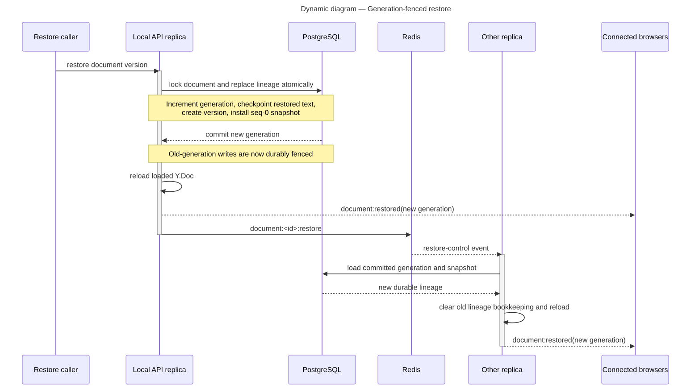

# Persistence, compaction, and restore

Collaborative durability is a PostgreSQL protocol. Redis accelerates allocation
and carries control/fan-out messages, but document advisory locks, generation
checks, and committed rows are the correctness boundary.

## Ordering durable updates

Each active `Y.Doc` is tagged with the `Document.crdtGeneration` from which it
was loaded. A write is appended to a process-local per-document promise chain,
then runs in a PostgreSQL transaction that:

1. acquires a transaction-scoped advisory lock derived from the document ID;
2. rereads the document generation and rejects a stale lineage;
3. returns an existing row when the generation/update ID already committed;
4. allocates the next sequence for that generation; and
5. inserts the update before committing.

When Redis is ready, a seed-and-increment Lua operation accelerates sequence
allocation. The first local use seeds the prefixed per-lineage counter from the
maximum durable update/snapshot sequence; later writes use increment. If Redis
is unavailable or a command fails, the transaction reads the same PostgreSQL
high-water mark while still holding the advisory lock. Sequence uniqueness and
ordering therefore survive Redis failure.

The process-local chain preserves local call order and gives graceful shutdown
something to drain. It does not coordinate replicas. After document teardown,
the service waits for the captured chain tail and removes local bookkeeping if
no newer write appeared. The shared Redis sequence key remains in place.

## Compaction

Each process counts its own successful writes. At the configured threshold it
attempts compaction under the same document advisory lock:

<picture>
  <source media="(prefers-color-scheme: dark)" srcset="../diagrams/rendered/compaction-dark.svg">
  <source media="(prefers-color-scheme: light)" srcset="../diagrams/rendered/compaction-light.svg">
  
</picture>

Using the same lock for writes and compaction prevents a lower-sequence write
from being inserted after compaction has deleted rows through a higher cutoff.
The snapshot is rebuilt from durable rows, not copied from one replica's
possibly divergent in-memory document. Compaction is asynchronous and
best-effort; it reduces replay cost but is not the durability acknowledgement.
The client durability boundary remains post-commit `yjs:ack`.

## Generation-fenced restore

Restore replaces a lineage because merging an older plain-text version into the
current CRDT would preserve unwanted pre-restore items.

<picture>
  <source media="(prefers-color-scheme: dark)" srcset="../diagrams/rendered/restore-dark.svg">
  <source media="(prefers-color-scheme: light)" srcset="../diagrams/rendered/restore-light.svg">
  
</picture>

Any old-generation write that reaches its locked transaction after the restore
is fenced and cannot commit. A replica that misses the Redis restore channel is
still protected durably; a periodic generation audit compares loaded documents
with PostgreSQL and reloads stale ones. A fenced write also triggers an
immediate database resynchronization attempt.

Terminal projection is updated only after the restore transaction and remains
best-effort. Redis control delivery and client resync improve convergence; the
generation check is what prevents pre-restore state from becoming durable
again.

The roles of checkpoints and versions are explained in
[Document model and save](document-model-and-save.md). Live relay and
acknowledgement timing are in
[Realtime collaboration](realtime-collaboration.md).
