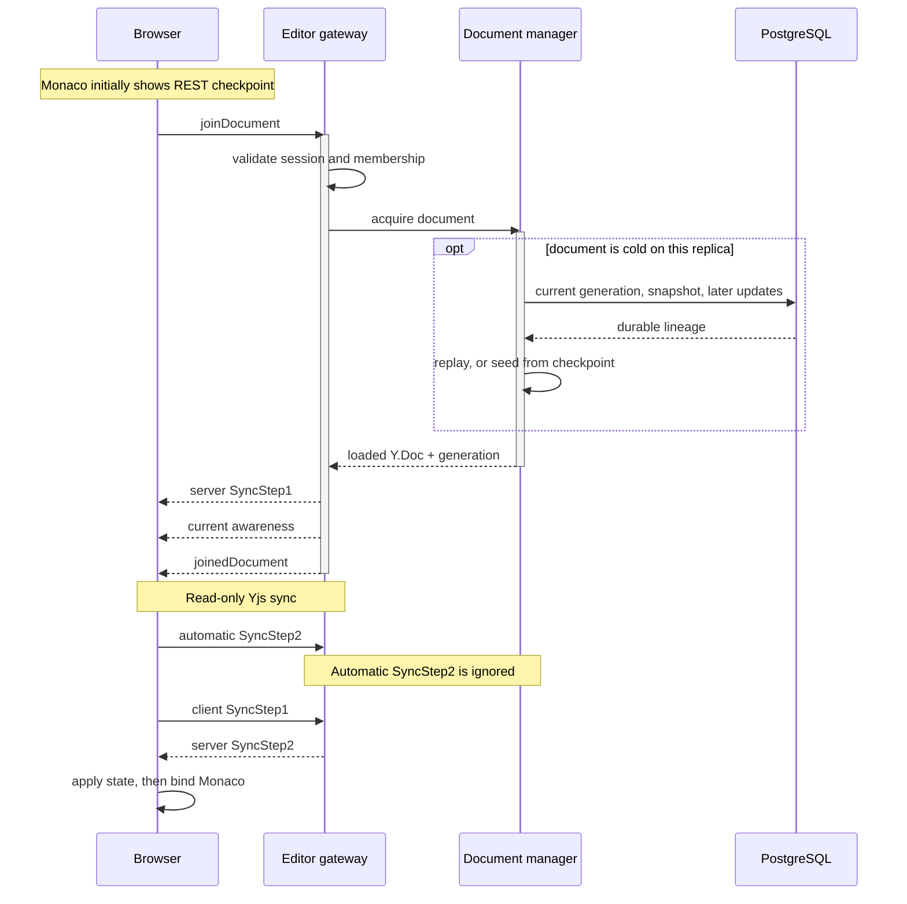
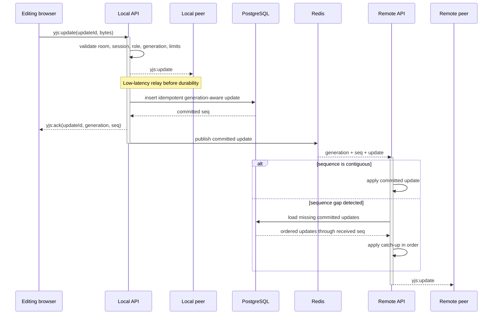

# Realtime collaboration

Meridian uses Socket.IO for connection management and Yjs for document
convergence. Socket rooms remain process-local: `document:<id>` scopes editing
and awareness, while `workspace:<id>` scopes chat. Redis manually fans selected
events across replicas; Meridian does not install the Socket.IO Redis adapter.

## Join and synchronize

The `yjs:sync` handler intentionally accepts only client SyncStep1. It ignores
the protocol's automatic SyncStep2 response and rejects other mutating sync
messages. All mutation uses `yjs:update`, where room membership, active session,
current role, payload size, durable persistence, and relay policy are enforced.
This closes a second write path that would otherwise bypass write-role checks.

One process shares a loading promise and `Y.Doc` among concurrent joins. The
document is reference-counted and destroyed after a configurable grace period
once its final local socket releases it.

## Live update and durable acknowledgement

Local peers receive the update before PostgreSQL commit for low latency. The
sender receives `yjs:ack` only after commit and keeps the update in its
IndexedDB outbox until then. A persist failure produces `yjs:nack` and leaves
the outbox entry available for retry with the same `updateId`; the earlier
in-memory apply is not rolled back.

Cross-replica publication also occurs only after commit and carries the
generation and sequence. A receiving replica applies messages only for a
document and generation it already has loaded. If it observes a sequence gap,
it loads the missing updates from PostgreSQL before continuing. This provides a
durable catch-up path for committed Yjs updates, but not for every realtime
feature.

## Presence, chat, and authorization

Awareness and chat are ephemeral. They are relayed to local rooms and through
Redis but are not stored or replayed. Presence rebuilds as clients publish new
state; missed chat is lost. Awareness client IDs are tracked per socket so
disconnect and leave can relay removal. Before relay, each owned awareness
state's user ID, display name, and deterministic color are replaced with the
authenticated user's values.

Protected events use per-socket rate limits and short authorization caches.
Logout, password reset, membership changes, workspace deletion, and account
deletion invalidate local and remote caches; periodic audits are the fallback.
Viewers may join, receive document updates, use awareness, and chat, but cannot
send document mutations.

Restore is a lineage change rather than an ordinary Yjs update. The
`document:restored` event makes clients discard their local lineage and rejoin;
see [Persistence, compaction, and restore](persistence-compaction-and-restore.md).
Redis outage behavior and replica topology are in
[Scaling and failure model](scaling-and-failure-model.md).
