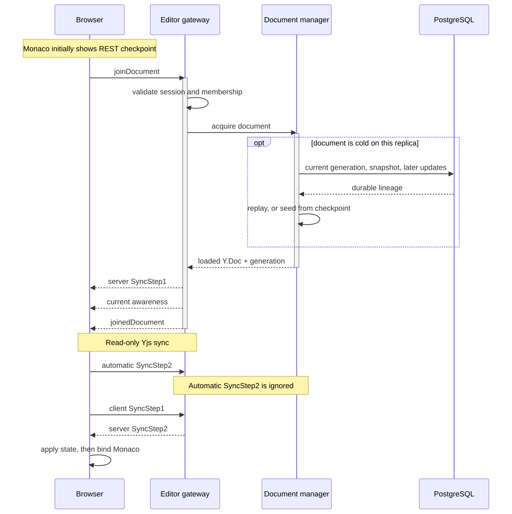
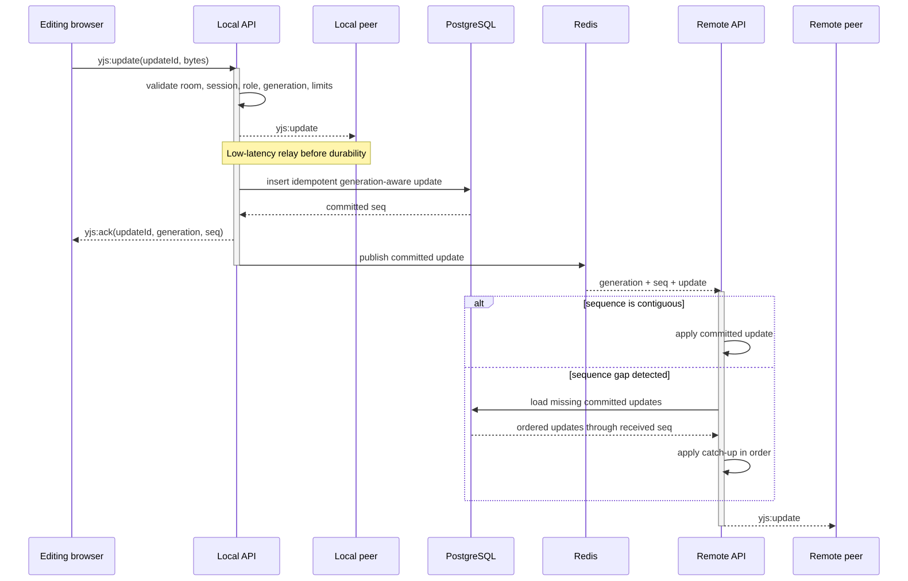

# Realtime collaboration

Meridian uses Socket.IO for connection management and Yjs for document
convergence. Socket rooms remain process-local: `document:<id>` scopes editing
and awareness, while `workspace:<id>` scopes chat. Redis manually fans selected
events across replicas; Meridian does not install the Socket.IO Redis adapter.

## Join and synchronize

<picture>
  <source media="(prefers-color-scheme: dark)" srcset="../diagrams/rendered/realtime-join-dark.svg">
  <source media="(prefers-color-scheme: light)" srcset="../diagrams/rendered/realtime-join-light.svg">
  
</picture>

The `yjs:sync` handler intentionally accepts only client SyncStep1. It ignores
the protocol's automatic SyncStep2 response and rejects other mutating sync
messages. All mutation uses `yjs:update`, where room membership, active session,
current role, payload size, durable persistence, and relay policy are enforced.
This closes a second write path that would otherwise bypass write-role checks.

One process shares a loading promise and `Y.Doc` among concurrent joins. The
document is reference-counted and destroyed after a configurable grace period
once its final local socket releases it.

## Live update and durable acknowledgement

<picture>
  <source media="(prefers-color-scheme: dark)" srcset="../diagrams/rendered/realtime-update-dark.svg">
  <source media="(prefers-color-scheme: light)" srcset="../diagrams/rendered/realtime-update-light.svg">
  
</picture>

Local peers receive the update before PostgreSQL commit for low latency. The
sender receives `yjs:ack` only after commit and keeps the update in its
IndexedDB outbox until then. A persist failure produces `yjs:nack` and leaves
the outbox entry available for retry with the same `updateId`; the earlier
in-memory apply is not rolled back.

Cross-replica publication occurs only after commit and carries the generation
and sequence. A receiving replica reconstructs missing state from a consistent
PostgreSQL snapshot plus subsequent updates, including edits whose individual
rows compaction has removed. A local commit does not advance the replica's
contiguous recovery watermark. A 15-second audit also repairs missed final
events when no later publication arrives. The loaded document identity and
generation are checked again after the read to avoid applying into a restored
or replaced document.

## Presence, chat, and authorization

Awareness and chat are ephemeral. They are relayed to local rooms and through
Redis but are not stored or replayed. Presence rebuilds as clients publish new
state; missed chat is lost. Awareness client IDs are tracked per socket so
disconnect and leave can relay removal. Before relay, each owned awareness
state's user ID, display name, and deterministic color are replaced with the
authenticated user's values.

Protected events use per-socket rate limits and short authorization caches.
Logout, password reset, membership changes, workspace deletion, and account
deletion invalidate local and remote caches; periodic audits are the fallback.
Viewers may join, receive document updates, use awareness, and chat, but cannot
send document mutations.

Restore is a lineage change rather than an ordinary Yjs update. The
`document:restored` event makes clients discard their local lineage and rejoin;
see [Persistence, compaction, and restore](persistence-compaction-and-restore.md).
Redis outage behavior and replica topology are in
[Scaling and failure model](scaling-and-failure-model.md).

## Browser recovery

Every outgoing update carries the generation in which it was created. IndexedDB
retains that generation with the update ID and bytes. Recovery runs after the
initial binding is ready as well as on reconnect, and retries at most 20 queued
updates each second while connected. A fresh page applies recovered updates to
its own Yjs document before sending them; the sender does not receive its own
local relay.

Entries from another generation, and legacy entries without a known generation,
are moved atomically to a separate IndexedDB recovery archive. They never enter
the restored document. **Export Recovery Data** in the command palette downloads
those original update records as JSON for recovery analysis; it does not promise
to reconstruct readable text without the original CRDT dependencies. Keep the
browser profile until any needed recovery data has been exported.

The API now requires `generation` on `yjs:update`. Deploy the client and server
together and reload already-open clients when upgrading.
