# Scaling and failure model

Meridian can distribute stateless HTTP work, but realtime state is partly
process-local. A single API process is therefore the simplest topology.
Multiple replicas require shared PostgreSQL, shared private Redis, and affinity
for each complete Socket.IO session.

<picture>
  <source media="(prefers-color-scheme: dark)" srcset="../diagrams/rendered/scaling-failure-dark.svg">
  <source media="(prefers-color-scheme: light)" srcset="../diagrams/rendered/scaling-failure-light.svg">
  
</picture>

The client permits WebSocket and HTTP long-polling. Affinity must cover the
handshake, polling requests, transport upgrade, and remaining connection—not
only the upgraded WebSocket. Ordinary guarded HTTP requests can reach any
replica because JWTs and sessions are validated against shared PostgreSQL.

## State ownership

PostgreSQL owns users, sessions, authorization, document metadata, saved
checkpoints, versions, generation-aware updates, and snapshots. Advisory locks
serialize durable update, compaction, checkpoint, and restore work per document.

Each API process owns its Socket.IO sockets and rooms, loaded `Y.Doc` and
awareness instances, short authorization caches, rate counters, persistence
chains, PTYs, and temporary projections. A hot document open on several
replicas therefore consumes memory on each.

Redis carries committed Yjs updates, awareness, chat, authorization
invalidations, restore-control events, terminal projection operations, and
accelerated sequence counters. `REDIS_KEY_PREFIX` is applied to every key and
channel so deployments can have distinct namespaces. Redis remains trusted
internal input and Pub/Sub has no replay.

## What converges

Durable Yjs writes are idempotent by generation/update ID and ordered under a
PostgreSQL document lock. A sender receives `yjs:ack` only after commit.
Post-commit Redis messages include sequence numbers, allowing a loaded replica
that detects a gap to catch up updates from PostgreSQL.

Version restore increments the generation and fences old writes in PostgreSQL.
The `document:<id>:restore` Redis channel promptly reloads peer replicas, while
a periodic generation audit repairs a missed control message. These mechanisms
make durable document history and restore stronger than generic Pub/Sub.

Awareness and chat are intentionally ephemeral and cannot be replayed.
Terminal projection operations are unversioned and best-effort, so conflicting
operations handled by different replicas can be observed in different orders.
Process-local rate limits also multiply with replica count.

## Dependency failures

| Failure | Current behavior |
|---|---|
| PostgreSQL unavailable | Readiness fails; protected data paths and durable collaboration fail. In-memory text is not a replacement for committed rows. |
| Redis unavailable at startup | The API may continue for single-process use; Redis-required readiness stays blocked. Durable sequence allocation falls back to PostgreSQL. |
| Redis connection closes | Availability becomes false; commands are not buffered. Clients reconnect with capped backoff and subscriptions are restored after readiness. |
| Redis client becomes ready | Availability becomes true again. Lost Pub/Sub messages are not replayed; committed Yjs sequence gaps can catch up, awareness/chat cannot. |
| Graceful API termination | Known write chains drain, dependencies close, PTYs stop, and clients reconnect elsewhere. |
| Crash, forced kill, or host loss | No drain occurs; uncommitted in-memory work, presence, chat, sockets, and PTYs on that process are lost. |
| Affinity loss | Polling or upgrade traffic can reach a process that does not own the Socket.IO session, causing errors or reconnects. |

Redis has no offline queue, so recovery of the connection is not recovery of
messages published during the outage. In a multi-replica deployment, loss of
Redis means loss of reliable live fan-out even while PostgreSQL continues to
protect durable sequence and restore correctness.

Readiness can require Redis, but it cannot prove that historical live events
were delivered. Express trusted-proxy behavior is configured with
`TRUST_PROXY`; deployment-wide throttling still belongs at the ingress. See
[Trust boundaries](trust-boundaries.md).

Measured single-process evidence is recorded separately in
[Performance baseline](performance-baseline.md), and residual guarantees are
summarized in [Known limitations](../reference/known-limitations.md).
