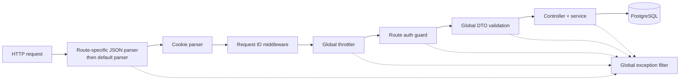

# Server architecture

The server is one NestJS application exposing REST and Socket.IO on the same
HTTP listener. Modules divide domain responsibility, while shared Prisma,
Redis, authorization, logging, and metrics services provide infrastructure.

- Auth and users own accounts, sessions, password reset, profiles, and account
  deletion.
- Workspaces and invites own canonical ownership, membership roles, and
  invitation lifecycle.
- Documents own the tree, checkpoint, import/export, versions, and restore.
- Realtime owns Socket.IO rooms, Yjs state, awareness, chat, durable update
  persistence, and cross-replica relays.
- Terminal owns optional PTYs and disposable saved-file projections.

Swagger is a development and test aid. Bootstrap mounts `/docs` and its JSON
document only when `NODE_ENV` is not `production`; there is no production
Swagger route to secure at the application layer.

## HTTP pipeline

Body parsing is registered as Express middleware and therefore occurs before
Nest guards and throttling. Larger document and bulk-import routes have
dedicated parser limits; all requests still need ingress-level protection
because unauthenticated bytes have already reached the parser.

The global validation pipe transforms supported DTO values, strips no unknown
input silently, and rejects non-whitelisted properties. The exception filter
normalizes failures, hides unexpected 5xx details, and attaches correlation
metadata. Request IDs are either accepted from `X-Request-Id` or generated;
they aid tracing but are not authenticated identity.

HTTP throttling uses named default and auth budgets backed by process memory.
It is useful for accidental or small-scale abuse, not a fleet-wide security
boundary. Express client-IP interpretation is explicitly configured through
`TRUST_PROXY`.

## Runtime lifecycle

PostgreSQL is required for meaningful operation. Redis may be optional for a
single-process topology or required as a readiness gate for a multi-replica
topology. `/health` reports process liveness. `/ready` probes PostgreSQL and
Redis; PostgreSQL failure makes the process not ready, and Redis failure does so
only when Redis is configured as required.

The Redis service uses separate publisher and subscriber clients. Its
availability flag becomes false on connection `close` and true on `ready`, so
readiness and callers observe reconnect state rather than a startup-only
decision. Registered pattern subscriptions are reapplied when the subscriber
becomes ready.

Nest shutdown hooks drain known local document write chains, disconnect
dependencies, and kill PTYs. Process exit releases loaded in-memory documents,
but production shutdown does not explicitly call the test-only
`DocumentManagerService.destroyAll()`. Graceful termination cannot recover work
after a forced kill or host loss. Those failure semantics are canonical in
[Scaling and failure model](scaling-and-failure-model.md).

The server's static-client separation and external dependencies are shown in
[System overview](system-overview.md); security ownership is explained in
[Trust boundaries](trust-boundaries.md).
