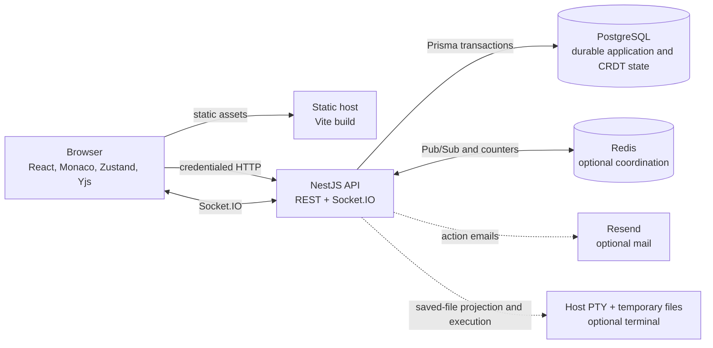

# System overview

Meridian is a collaborative browser IDE split into two independently built
applications: a React single-page application and a NestJS API. The API exposes
REST and Socket.IO on one listener; it does not serve the Vite build. Keeping
static delivery separate lets the client be cached and deployed independently,
but the static host must provide SPA fallback and route API and Socket.IO
traffic before that fallback.

PostgreSQL is the durable system of record. Redis accelerates sequence
allocation and carries cross-process live events, but is not required for
durable document ordering and is not a backup. A single API process is the
simplest collaboration topology; multiple replicas add process-local state and
best-effort fan-out concerns described in
[Scaling and failure model](scaling-and-failure-model.md).

Collaborative text deliberately has two durable views:

- the current Yjs lineage in `Snapshot` and `DocumentUpdate`, used to rebuild
  live collaborative state; and
- `Document.content`, an explicit saved checkpoint used by ordinary REST reads,
  export, versions, and terminal materialization.

That separation preserves fast collaborative updates while making “Save” an
explicit product boundary. See
[Document model and save](document-model-and-save.md).

The major concerns are intentionally separated:

- [Client architecture](client-architecture.md) owns routing, UI state, Monaco,
  and browser-side collaboration bindings.
- [Server architecture](server-architecture.md) owns request processing,
  validation, application modules, and runtime lifecycle.
- [Authentication and sessions](authentication-and-sessions.md) establishes
  identity; [Authorization and roles](authorization-and-roles.md) scopes that
  identity to workspaces and operations.
- [Realtime collaboration](realtime-collaboration.md) explains live transport;
  [Persistence, compaction, and restore](persistence-compaction-and-restore.md)
  explains its durable correctness boundary.
- [Terminal execution](terminal-execution.md) is an optional host-execution
  feature with a distinct and much stronger risk profile.

TLS termination, DNS, static hosting, load balancing, backups, secret
distribution, and operating-system isolation are deployment responsibilities,
not capabilities of the NestJS process. The resulting security boundaries are
catalogued in [Trust boundaries](trust-boundaries.md).
