# Terminal execution

The terminal supports a development-only host PTY backend and a separate isolated
worker backend. Both import settled text changes back into saved documents.
Production rejects the host backend and requires an authenticated worker using
gVisor. See [isolated terminal setup](../how-to/run-isolated-terminals.md) for
resource limits, deployment requirements, and remaining host qualification.

The worker receives files through bounded JSON operations; no API directories or
credentials are mounted into workloads. Its file helper runs inside the sandbox.
The host implementation described below remains available for trusted local work.

## Projection model

<picture>
  <source media="(prefers-color-scheme: dark)" srcset="../diagrams/rendered/terminal-projection-dark.svg">
  <source media="(prefers-color-scheme: light)" srcset="../diagrams/rendered/terminal-projection-light.svg">
  
</picture>

Starting the first session for a workspace/user projection recreates a
directory beneath the operating system temporary directory and materializes
the database document tree from `Document.content`. It then spawns the
configured shell with that directory as `cwd` and `HOME`, passing a reduced
environment that excludes application secrets.

There is at most one terminal session per socket. Concurrent sockets for the
same user and workspace have separate PTYs but share a reference-counted local
projection. Materialization and filesystem operations are serialized per root
to avoid cleanup and replacement races.

Document create, import, checkpoint, rename, delete, and restore operations are
projected to active local sandboxes and published through Redis for other
replicas. This path is best-effort, unversioned, and not replayed. Live Yjs
updates do not update the projection until a checkpoint changes
`Document.content`.

## Terminal text files save back to the workspace

A bounded scan runs every 500 ms while a shell is active. New and edited UTF-8
text files must match in two consecutive scans before import. A final scan runs
before normal last-session cleanup, including a shell that writes a file and
immediately exits. Temporary database failures keep the local files and their
previous baseline for retry; they do not advance the saved indicator.

Imports recheck the session and workspace write permission. They create parent
folders and save PostgreSQL checkpoints with version history. Replacing an
existing file takes the document advisory lock and advances its CRDT generation,
using the same stale-update fence as version restore. Open editors resynchronize,
and a workspace notification refreshes file trees on connected clients without
closing tabs or replacing unrelated unsaved editor text. Other active terminal
projections receive the saved content through the existing Redis fan-out.

If the saved checkpoint or durable collaborative text has changed since it was
projected, the terminal text is preserved under `terminal-conflicts/` rather
than overwriting the editor. The terminal prints the recovery path and the UI
adds a notification. Repeated imports of the same conflict reuse that copy.
Editor-to-terminal writes also leave unimported shell edits intact until they
can be saved or preserved as a conflict.

The import scope is deliberately text source files:

- Files are limited to 1 MiB each, 1,000 text files and 25 MiB per scanned tree.
  Traversal is bounded to 4,000 entries and 64 folder levels.
- Symlinks, hard links, special files, binary/non-UTF-8 files, and oversized files
  are excluded. Dependency, cache, build, Git-internal, and shell-history paths
  are excluded by `terminal-files.ts`; for example `node_modules`, `.venv`,
  `__pycache__`, `.git`, `dist`, and `build` remain local.
- Shell deletions do not delete saved workspace documents. Rename/delete saved
  files through the explorer; shell `mv` imports the destination as a new file
  and retains the previously saved source. Empty directories and executable
  permission bits are not represented in the document model.
- The saved indicator confirms an import, not every keystroke. A process crash
  before a scan commits can still lose recent shell changes. This is not a
  durable disk mount or a Git working-tree synchronization service.

## Run-file dispatch

The helper maps supported extensions to host commands:

- `.py` → `python3`
- `.js` → `node`
- `.ts` → `npx --no-install tsx`
- `.sh` → `bash`
- `.go` → `go run`

Those runtimes must exist on the API host. The selected database document must
belong to the requested workspace and be a file. Relative-path validation,
shell quoting, safe joins, symlink checks, and no-follow writes protect the
projection helper from straightforward path escape and command construction
bugs.

## Security and lifetime

These checks do not confine the interactive shell. The PTY runs as the API
operating-system user and can change directory, run arbitrary commands, consume
host resources, use the network, and read anything that account can access.
Changing `cwd` and `HOME` and reducing environment variables are convenience
boundaries, not isolation.

Only owners and editors can start, use, resize, or run files. Session and role
changes are rechecked through the realtime authorization layer; invalidation or
audit failure kills affected PTYs. Sessions are also killed on explicit stop,
socket disconnect, idle timeout, absolute lifetime, and module shutdown.

Normal final-session teardown removes the shared temporary projection after
a final import and serialized cleanup. Failed imports retain the local directory
for retry in the same server process. A crash or host loss can leave files behind. There is no
global user quota for PTYs, child processes, CPU, memory, network, or temporary
storage. These residual risks are summarized in
[Known limitations](../reference/known-limitations.md), while the broader security boundary
is defined in [Trust boundaries](trust-boundaries.md).
