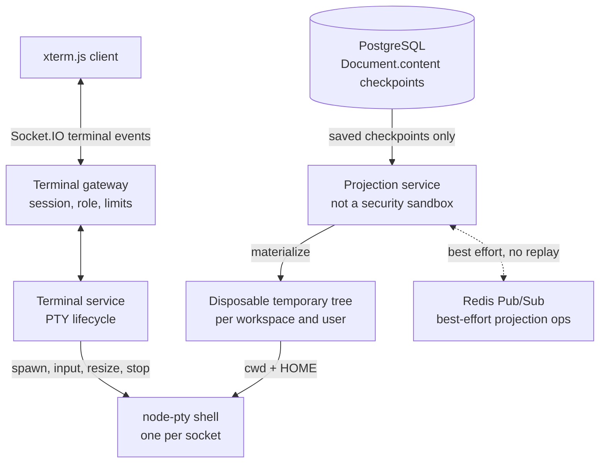

# Terminal execution

The terminal is an optional Socket.IO feature that starts a host-backed
`node-pty` shell. It exists to run saved workspace files near the API; it is not
a browser sandbox, container runner, or bidirectional filesystem editor.

Production environment validation rejects `ENABLE_TERMINAL=true`. In
non-production it is disabled by default and still requires deliberate host
isolation.

## Projection model



Starting the first session for a workspace/user projection recreates a
directory beneath the operating system temporary directory and materializes
the database document tree from `Document.content`. It then spawns the
configured shell with that directory as `cwd` and `HOME`, passing a reduced
environment that excludes application secrets.

There is at most one terminal session per socket. Concurrent sockets for the
same user and workspace have separate PTYs but share a reference-counted local
projection. Materialization and filesystem operations are serialized per root
to avoid cleanup and replacement races.

Document create, import, checkpoint, rename, delete, and restore operations are
projected to active local sandboxes and published through Redis for other
replicas. This path is best-effort, unversioned, and not replayed. Live Yjs
updates do not update the projection until a checkpoint changes
`Document.content`.

The direction is one-way:

```text
saved PostgreSQL checkpoint -> disposable temporary projection
```

Files created or modified by shell commands are never written back to
PostgreSQL, Yjs, version history, or export. Re-materialization discards such
terminal-only changes.

## Run-file dispatch

The helper maps supported extensions to host commands:

- `.py` → `python3`
- `.js` → `node`
- `.ts` → `npx --no-install tsx`
- `.sh` → `bash`
- `.go` → `go run`

Those runtimes must exist on the API host. The selected database document must
belong to the requested workspace and be a file. Relative-path validation,
shell quoting, safe joins, symlink checks, and no-follow writes protect the
projection helper from straightforward path escape and command construction
bugs.

## Security and lifetime

These checks do not confine the interactive shell. The PTY runs as the API
operating-system user and can change directory, run arbitrary commands, consume
host resources, use the network, and read anything that account can access.
Changing `cwd` and `HOME` and reducing environment variables are convenience
boundaries, not isolation.

Only owners and editors can start, use, resize, or run files. Session and role
changes are rechecked through the realtime authorization layer; invalidation or
audit failure kills affected PTYs. Sessions are also killed on explicit stop,
socket disconnect, idle timeout, absolute lifetime, and module shutdown.

Normal final-session teardown removes the shared temporary projection after
serialized cleanup. A crash or host loss can leave files behind. There is no
global user quota for PTYs, child processes, CPU, memory, network, or temporary
storage. These residual risks are summarized in
[Known limitations](../reference/known-limitations.md), while the broader security boundary
is defined in [Trust boundaries](trust-boundaries.md).
