# Containers and Compose

## Development Compose

File: [`server/docker-compose.yml`](../../../server/docker-compose.yml).

| Service | Image | Host port | Data |
|---|---|---:|---|
| `postgres` | `postgres:16` | 5432 | `postgres_data` volume; database `meridian`, user/password `postgres` |
| `redis` | `redis:7` | 6379 | `redis_data` volume |

Host ports default to 5432 and 6379. Set `POSTGRES_PORT` and `REDIS_PORT` when
the defaults are already occupied or when creating an isolated local test
project; container ports and application defaults are unchanged.

The development file defines no health checks and no application service.
`npm run infra:up` and `npm run infra:down` run this Compose file from
`server/`.

## Server image

File: [`server/Dockerfile`](../../../server/Dockerfile).

| Stage/target | Base | Contents and command |
|---|---|---|
| `dependencies` | `node:22-alpine3.24` | Build toolchain, lockfile install, Prisma and scripts |
| `build` | dependencies | Prisma generate, Nest build, production dependency prune |
| `runtime-base` | `node:22-alpine3.24` | `tini`, OpenSSL/CAs, non-login uid/gid 10001; npm/Corepack removed |
| `migrate` | runtime-base | Prisma CLI/client/schema only; `prisma migrate deploy` |
| `runtime` (default) | runtime-base | Compiled API, production dependencies, Prisma schema; `node dist/main.js` |

Both runnable targets use the `meridian` non-root user. The API exposes 3000.
The image sets `NODE_ENV=production`, `PORT=3000`, and `SHELL=/bin/sh`.

## Client image

File: [`client/Dockerfile`](../../../client/Dockerfile).

| Stage | Base | Action |
|---|---|---|
| `build` | `node:22-alpine3.24` | `npm ci`, TypeScript/Vite build |
| `runtime` | `nginx:1.31-alpine3.24-slim` | Serve `dist/` on 8080 as non-root `meridian` |

Build arguments:

| Argument | Default | Stage |
|---|---|---|
| `VITE_API_URL` | empty | Vite build |
| `VITE_SOCKET_URL` | empty | Vite build |
| `CSP_CONNECT_SRC_EXTRA` | empty | Nginx configuration generation |

Nginx applies SPA fallback to `index.html`, marks `index.html` `no-store`, and
marks matching static assets immutable for seven days. See
[client CSP](../client/csp.md).

## Production Compose

File: [`docker-compose.prod.yml`](../../../docker-compose.prod.yml).

| Service | Network exposure | Dependency/order |
|---|---|---|
| `postgres` | Internal 5432 only | Health checked with `pg_isready`; persistent volume |
| `redis` | Internal 6379 only | AOF enabled; health checked; persistent volume |
| `migrate` | Internal, one-shot | Waits for PostgreSQL; runs server `migrate` target |
| `api` | Internal 3000 only | Waits for migration, PostgreSQL, Redis; `/ready` health check |
| `web` | Internal 8080 only | Built with client arguments; waits for healthy API |
| `caddy` | Publishes TCP 80/443 and UDP 443 | Waits for API health and web start |
| `prometheus` | Optional `monitoring` profile; host loopback 9090 only | Waits for API and Alertmanager; scrapes internal `/metrics` and evaluates committed rules |
| `alertmanager` | Optional `monitoring` profile; host loopback 9093 only | Reads a Docker secret containing the paging webhook URL and routes alerts |

### Runtime topology

<picture>
  <source media="(prefers-color-scheme: dark)" srcset="../../diagrams/rendered/production-runtime-dark.svg">
  <source media="(prefers-color-scheme: light)" srcset="../../diagrams/rendered/production-runtime-light.svg">
  
</picture>

### Monitoring and backup topology

<picture>
  <source media="(prefers-color-scheme: dark)" srcset="../../diagrams/rendered/production-operations-dark.svg">
  <source media="(prefers-color-scheme: light)" srcset="../../diagrams/rendered/production-operations-light.svg">
  
</picture>

Named volumes are `postgres_data`, `redis_data`, `caddy_data`, `caddy_config`,
`prometheus_data`, and `alertmanager_data`. Caddy is the only publicly bound
service; both optional monitoring ports are bound to `127.0.0.1` only. Every
long-running production service uses `restart: unless-stopped`; the one-shot
migration remains `restart: "no"`.

Required Compose inputs:

| Variable | Use |
|---|---|
| `POSTGRES_PASSWORD` | PostgreSQL password and generated API/migration URL |
| `JWT_SECRET` | API signing secret |
| `CLIENT_ORIGIN` | API CORS and generated links |
| `DOMAIN` | Caddy public hostname |
| `ACME_EMAIL` | Caddy ACME contact; the committed Caddyfile always emits this directive |
| `LB_COOKIE_SECRET` | Caddy affinity-cookie signing |
| `RESEND_API_KEY` | Production email provider credential |
| `MAIL_FROM` | Sender on a verified custom domain |
| `ALERTMANAGER_WEBHOOK_URL_FILE` | Host file containing one approved HTTPS paging webhook URL when the `monitoring` profile is enabled |

Optional/defaulted Compose inputs:

| Variable | Default |
|---|---|
| `REDIS_KEY_PREFIX` | `prod:` |
| `EMAIL_VERIFICATION_TTL_MINUTES` | `1440` |
| `VITE_API_URL`, `VITE_SOCKET_URL` | empty |
| `CSP_CONNECT_SRC_EXTRA` | empty |
| `API_UPSTREAMS` | `api:3000` |
| `MAIL_TIMEOUT_MS` | `10000` milliseconds |
| `PROMETHEUS_IMAGE` | `prom/prometheus:v3.13.2` |
| `PROMETHEUS_RETENTION` | `15d` |
| `ALERTMANAGER_IMAGE` | Immutable official `main` image at revision `8d7515af` (see Compose for digest) |

The API service fixes `NODE_ENV=production`, `PORT=3000`,
`REDIS_REQUIRED=true`, `TRUST_PROXY=1`, `METRICS_ENABLED=true`, and
`ENABLE_TERMINAL=false`. It also fixes `EMAIL_VERIFICATION_REQUIRED=true`;
production configuration validation rejects attempts to disable it.

## Caddy routing

File: [`deploy/Caddyfile`](../../../deploy/Caddyfile).

- `/metrics`, `/docs`, `/docs/*`, `/e2e`, and `/e2e/*` return 404 at the edge.
- Auth, users, workspaces, documents, invites, health, readiness, and
  `/socket.io` paths proxy to `API_UPSTREAMS`.
- All remaining paths proxy to `web:8080`.
- API routing uses a signed `meridian_affinity` cookie, active `/ready` checks,
  passive failure checks, and brief connection retries.
- Caddy terminates TLS, enables zstd/gzip, sends one-year HSTS and common
  security headers, removes the `Server` header, and logs to stdout.

The application itself also omits Swagger in production. For operational
context and failure behavior, see the
[system overview](../../explanation/system-overview.md),
[trust boundaries](../../explanation/trust-boundaries.md), and
[scaling/failure model](../../explanation/scaling-and-failure-model.md).
